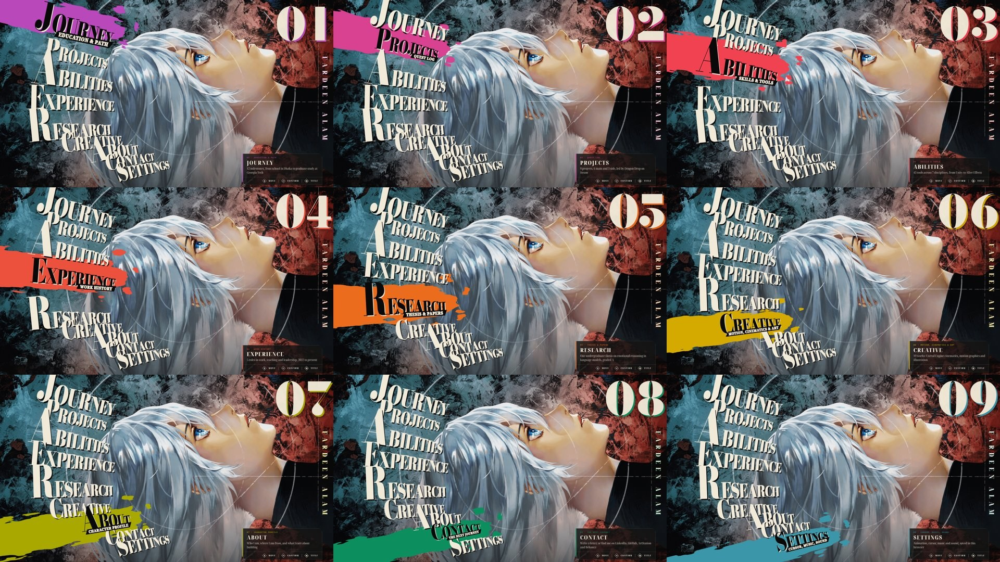

# Ahanaf Mokammel Omi — Portfolio

A portfolio that plays like a game menu, in the visual language of *Metaphor: ReFantazio*: a launch screen, a wheel of hand-lettered words, and one screen per section.



## Screens

Journey · Projects · Abilities · Experience · Research · Creative · About · Contact · Settings

Keyboard-first on desktop (arrows, Enter, Backspace), with mouse hover and click. Phones get touch layouts in both portrait and landscape.

## Stack

React 18 · TypeScript · Vite · Framer Motion. Content lives in `src/data/`, one file per section.

## Run

```bash
npm install
npm run dev
```

`npm run build` outputs to `dist/`; the site deploys on Vercel from `main`.
